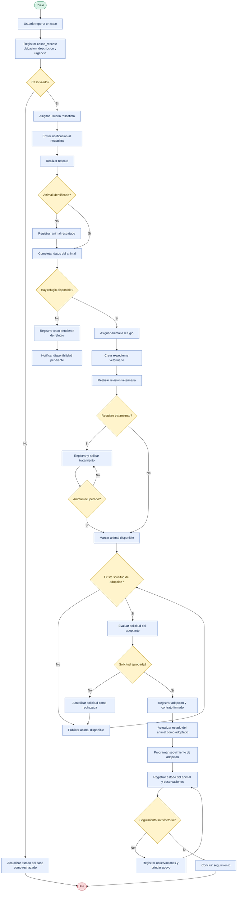

```mermaid
flowchart TD
    INICIO([Inicio]) --> REPORTE[Usuario reporta un caso]
    REPORTE --> REGISTRAR[Registrar casos_rescate\nubicacion, descripcion y urgencia]
    REGISTRAR --> VALIDAR{Caso valido?}

    VALIDAR -- No --> RECHAZAR[Actualizar estado del caso\ncomo rechazado]
    RECHAZAR --> FIN([Fin])
    VALIDAR -- Si --> ASIGNAR[Asignar usuario rescatista]
    ASIGNAR --> NOTIFICAR1[Enviar notificacion al rescatista]
    NOTIFICAR1 --> RESCATE[Realizar rescate]
    RESCATE --> ANIMAL{Animal identificado?}

    ANIMAL -- No --> REG_ANIMAL[Registrar animal rescatado]
    ANIMAL -- Si --> DATOS[Completar datos del animal]
    REG_ANIMAL --> DATOS
    DATOS --> REFUGIO{Hay refugio disponible?}

    REFUGIO -- No --> ESPERA[Registrar caso pendiente\nde refugio]
    ESPERA --> NOTIFICAR2[Notificar disponibilidad pendiente]
    REFUGIO -- Si --> INGRESO[Asignar animal a refugio]
    INGRESO --> EXPEDIENTE[Crear expediente veterinario]
    EXPEDIENTE --> REVISION[Realizar revision veterinaria]
    REVISION --> TRATAMIENTO{Requiere tratamiento?}

    TRATAMIENTO -- Si --> ATENDER[Registrar y aplicar tratamiento]
    ATENDER --> ALTA{Animal recuperado?}
    ALTA -- No --> ATENDER
    ALTA -- Si --> PREPARAR[Marcar animal disponible]
    TRATAMIENTO -- No --> PREPARAR

    PREPARAR --> SOLICITUD{Existe solicitud de adopcion?}
    SOLICITUD -- No --> PUBLICAR[Publicar animal disponible]
    PUBLICAR --> SOLICITUD
    SOLICITUD -- Si --> EVALUAR[Evaluar solicitud del adoptante]
    EVALUAR --> APROBAR{Solicitud aprobada?}

    APROBAR -- No --> ACTUALIZAR[Actualizar solicitud como rechazada]
    ACTUALIZAR --> PUBLICAR
    APROBAR -- Si --> CONTRATO[Registrar adopcion y contrato firmado]
    CONTRATO --> CAMBIAR[Actualizar estado del animal como adoptado]
    CAMBIAR --> SEGUIMIENTO[Programar seguimiento de adopcion]
    SEGUIMIENTO --> VISITA[Registrar estado del animal y observaciones]
    VISITA --> SATISFACTORIO{Seguimiento satisfactorio?}
    SATISFACTORIO -- No --> APOYO[Registrar observaciones y brindar apoyo]
    APOYO --> VISITA
    SATISFACTORIO -- Si --> CERRAR[Concluir seguimiento]
    CERRAR --> FIN

    classDef inicio fill:#d9f2e6,stroke:#238b5b,color:#123524
    classDef proceso fill:#e8f0fe,stroke:#4d73be,color:#172b4d
    classDef decision fill:#fff4cc,stroke:#b58b00,color:#4a3800
    classDef fin fill:#f8d7da,stroke:#b02a37,color:#58151c

    class INICIO inicio
    class REPORTE,REGISTRAR,RECHAZAR,ASIGNAR,NOTIFICAR1,RESCATE,REG_ANIMAL,DATOS,ESPERA,NOTIFICAR2,INGRESO,EXPEDIENTE,REVISION,ATENDER,PREPARAR,PUBLICAR,EVALUAR,ACTUALIZAR,CONTRATO,CAMBIAR,SEGUIMIENTO,VISITA,APOYO,CERRAR proceso
    class VALIDAR,ANIMAL,REFUGIO,TRATAMIENTO,ALTA,SOLICITUD,APROBAR,SATISFACTORIO decision
    class FIN fin
```