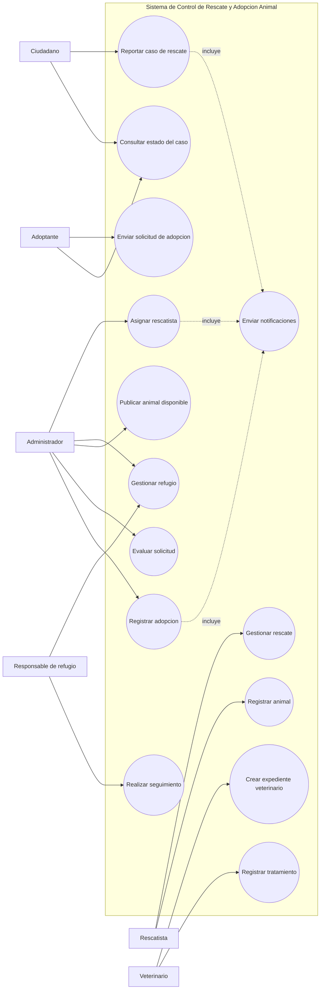
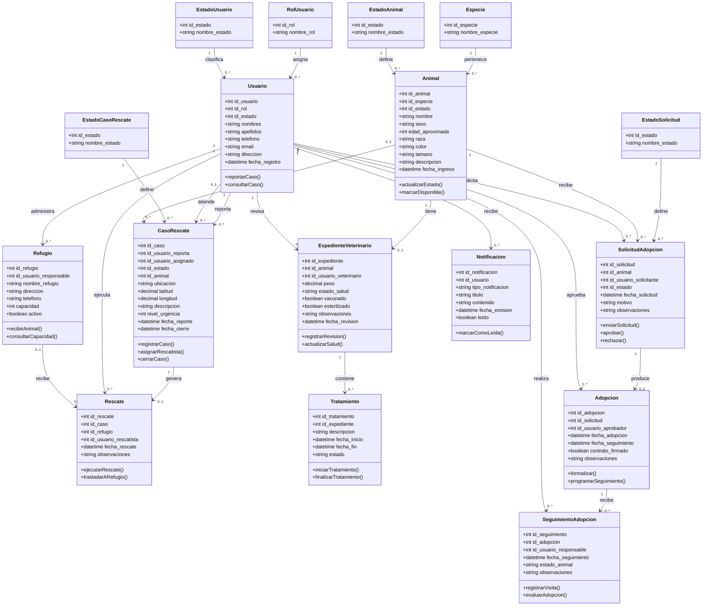
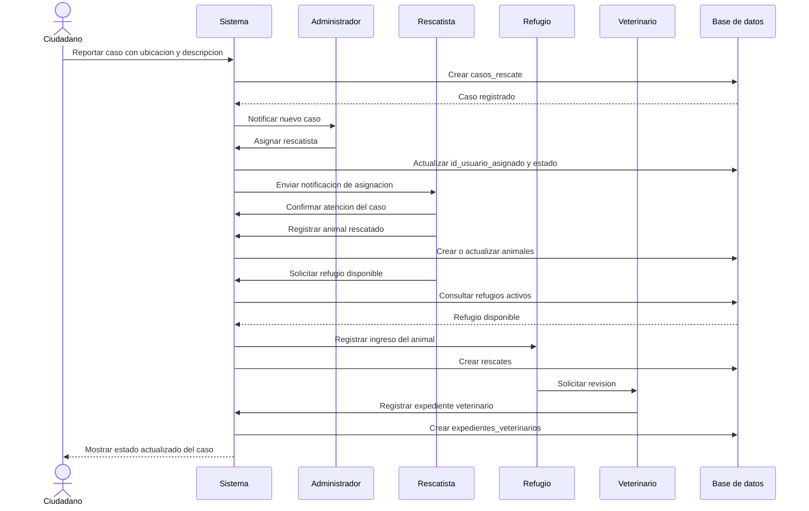
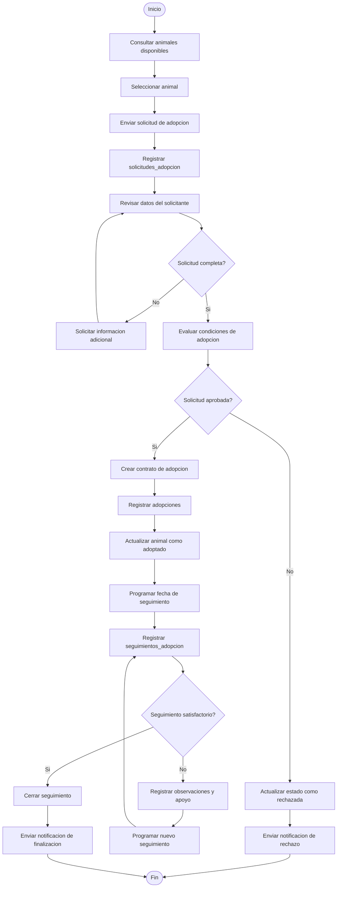
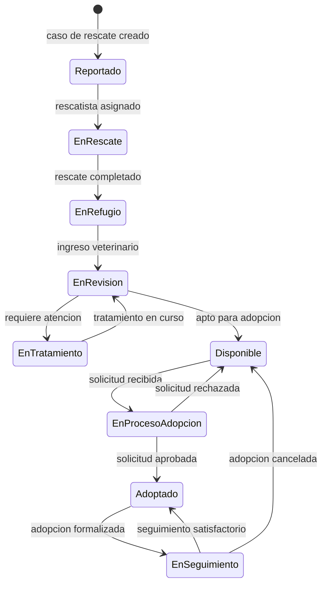
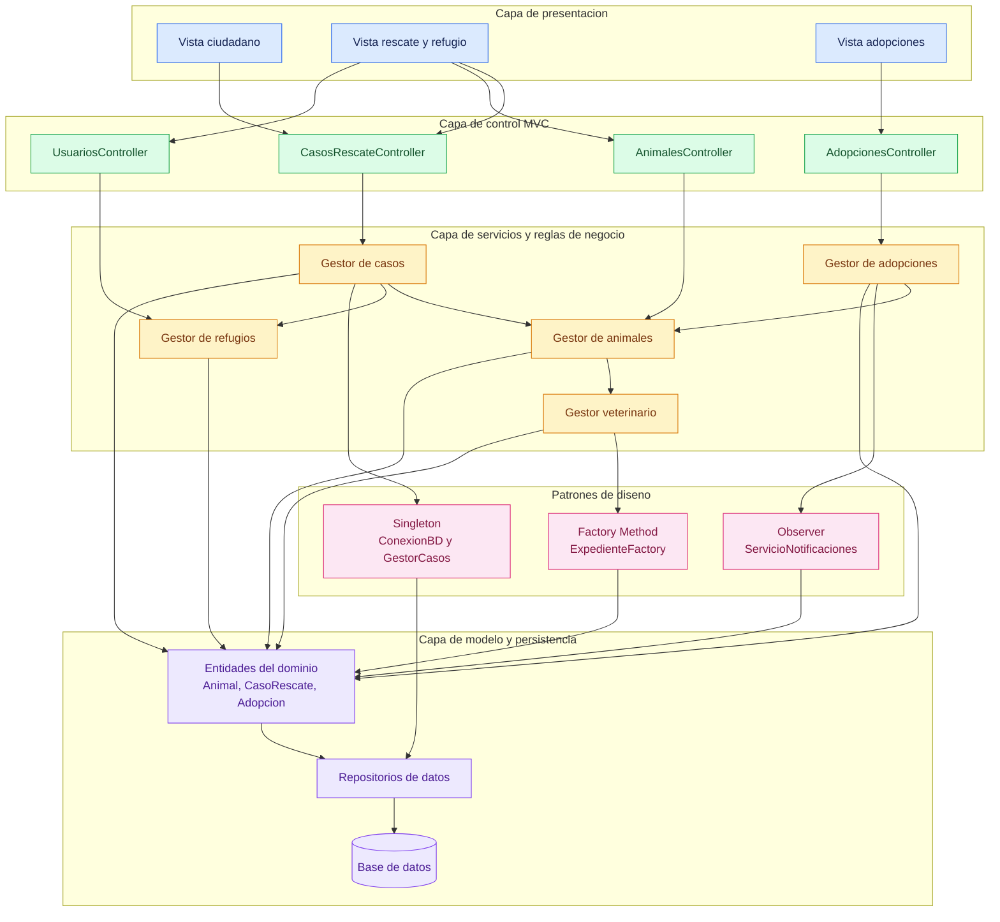

# UML - Sistema de Control de Rescate y Adopcion Animal

## 1. Diagrama de casos de uso

## 2. Diagrama de clases del dominio

## 3. Diagrama de secuencia: reporte y rescate

## 4. Diagrama de actividad: proceso de adopcion

## 5. Diagrama de estados del animal

## 6. Diagrama de arquitectura del sistema

### Descripcion de la arquitectura

- **Presentacion:** permite reportar casos, gestionar rescates y solicitar adopciones.
- **Control MVC:** recibe las acciones de las vistas y las envia al servicio correspondiente.
- **Servicios:** aplica las reglas de negocio de rescate, veterinaria, refugios y adopciones.
- **Patrones:** Singleton administra la conexion y el gestor central, Observer distribuye notificaciones y Factory Method crea expedientes por especie.
- **Modelo y persistencia:** representa las entidades y almacena la informacion en la base de datos.

